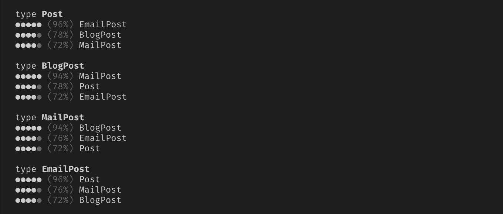

[](https://graphql-inspector.com/)

[](https://npmjs.com/package/@graphql-inspector/cli)
[](https://hub.docker.com/r/kamilkisiela/graphql-inspector)
[](https://github.com/prettier/prettier)
[](https://renovateapp.com/)
[](https://discord.gg/xud7bH9)

**GraphQL Inspector** ouputs a list of changes between two GraphQL schemas. Every change is precisely explained and marked as breaking, non-breaking or dangerous.
It helps you validate documents and fragments against a schema and even find similar or duplicated types.

## Features

Major features:

- **Compares schemas**
- **Finds breaking or dangerous changes**
- **Validates documents against a schema**
- **Finds similar / duplicated types**
- **Schema coverage based on documents**
- **Serves a GraphQL server with faked data and GraphQL Playground**
- **Github Bot**
- **Github Actions**
- **Docker Image**

GraphQL Inspector has a **CLI** and also a **programatic API**, so you can use it however you want to and even build tools on top of it.


## Installation

```bash
# CLI
yarn add @graphql-inspector/cli

# Core API for programatic usage
yarn add @graphql-inspector/core
```

### Compare schemas

Compares schemas and finds breaking or dangerous changes.

**CLI:**

    $ graphql-inspector diff OLD_SCHEMA NEW_SCHEMA

**API:**

```typescript
import {diff, Change} from '@graphql-inspector/core';

const changes: Change[] = diff(schemaA, schemaB);
```


### Find similar types

Finds similar / duplicated types.

**CLI:**

    $ graphql-inspector similar SCHEMA

**API:**

```typescript
import {similar, SimilarMap} from '@graphql-inspector/core';

const similar: SimilarMap = similar(schema, typename, threshold);
```



### Check coverage

Schema coverage based on documents. Find out how many times types and fields are used in your application.

**CLI:**

    $ graphql-inspector coverage DOCUMENTS SCHEMA

**API:**

```typescript
import {coverage, SchemaCoverage} from '@graphql-inspector/core';

const schemaCoverage: SchemaCoverage = coverage(schema, documents);
```


### Validate documents

Validates documents against a schema and looks for deprecated usage.

**CLI:**

    $ graphql-inspector validate DOCUMENTS SCHEMA

**API:**

```typescript
import {validate, InvalidDocument} from '@graphql-inspector/core';

const invalid: InvalidDocument[] = validate(documentsGlob, schema);
```


### Serve faked GraphQL API

Serves a GraphQL server with faked data and GraphQL Playground

**CLI:**

    $ graphql-inspector serve SCHEMA

```bash
✅ Serving the GraphQL API on http://localhost:4000/
```

### Introspect GraphQL server

Introspects a GraphQL Server and writes the result to a file

**CLI:**

    $ graphql-inspector introspect SCHEMA --write schema.json

```bash
✅ Introspection result saved to schema.json
```

### Github Bot and Github Actions

Have a per-repository, self-hosted GraphQL Inspector service or deploy it with Docker.

```bash
# install
yarn global add @graphql-inspector/actions

# use

$ graphql-inspector-github
```

```json
{
  "name": "app",
  "scripts": {
    "precommit": "graphql-inspector introspect schema.js --write schema.graphql && git add schema.graphql"
  },
  "graphql-inspector": {
    "diff": true,
    "schema": {
      "ref": "master",
      "path": "schema.graphql"
    }
  }
}
```

Get Github annotations in your PRs.


### CLI in more details

### `SCHEMA`

**Path to a CommonJS or ES Module that exports an object**

Example:

    graphql-inspector coverage ./src/documents.js ./src/schema.js

Example with TypeScript:

    graphql-inspector coverage ./src/documents.ts ./src/schema.ts --require ts-node/register

```typescript
// String
export default `
  type Query {
    hello: String
  }
`

// GraphQLSchema
export default makeExecutableSchema({...});

// GraphQL Document
export default gql`
  type Query {
    hello: String
  }
`

// IntrospectionQuery result
export default {
  data: {
    __schema: {
      ...
    }
  }
}
```

**Pointer to a Git repository**

Example:

    graphql-inspector diff git:origin/master:schema.graphql ./schema.graphql

Pattern:

    git:ref:path/to/file

**Pointer to a Github repository**

Example:

    graphql-inspector coverage ./src/documents.ts github:kamilkisiela/graphql-inspector-example#master:schema.graphql

Pattern:

    github:owner/name#ref:path/to/file

**GraphQL File**

Example:

    graphql-inspector coverage documents.js schema.graphql
    graphql-inspector coverage documents.js schema.gql

**JSON File**

Example:

    graphql-inspector coverage documents.js introspected-schema.json

**URL to a GraphQL endpoint**

Example:

    graphql-inspector coverage documents.js https://localhost:3000/graphql

### `DOCUMENTS`

**Glob pattern**

Example:

    graphql-inspector validate ./src/**/*.{js,jsx,tsx,graphql} https://localhost:3000/graphql

Supports TypeScript, JavaScript and GraphQL Files (_Extensions: ts,tsx,js,jsx,graphql,gql,graphqls_).

### Help

Find out what the CLI is capable of:

    graphql-inspector --help
    graphql-inspector similar --help

## Related

Some part of the library was ported to NodeJS from [Ruby's GraphQL Schema Comparator](https://github.com/xuorig/graphql-schema_comparator)

## License

[MIT](https://github.com/kamilkisiela/graphql-inspector/blob/master/LICENSE) © Kamil Kisiela
